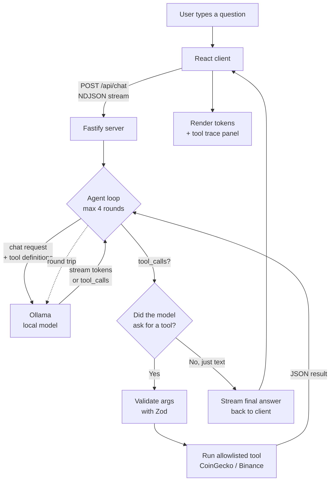

# Crypto AI Research

A small Vite + React + TypeScript app with a Node/Fastify backend that lets a local Ollama model call allowlisted crypto research tools.

> **Learning project.** The point is to see, end to end, how an LLM can decide *when* to call a function, how the host program executes it, and how the result feeds back into the next model turn — all using a free local model, no paid API keys required.

## What It Does

- Runs a clean chat UI in the browser.
- Sends chat requests to a local Node API.
- Uses Ollama locally, defaulting to `qwen3:4b`.
- Lets the model call only safe, allowlisted tools:
  - Search CoinGecko coins.
  - Fetch CoinGecko prices and market data.
  - Fetch CoinGecko trending coins.
  - Fetch Binance public pair price.
- Streams the model's response token-by-token to the browser as NDJSON.
- Keeps external API calls and tool execution on the backend.

This is for research and education only, not financial advice or trading automation.

## How Tool Calling Works (Big Picture)

The interesting bit isn't the chat UI — it's the **agent loop** on the server. The model never reaches the network itself. Instead, the server hands the model a list of tool *definitions* (name + JSON schema), and the model emits structured `tool_calls` when it wants data. The server runs the call, feeds the result back in as a `tool` message, and asks the model to continue. Repeat until the model produces a plain answer.



### One-message walkthrough

User asks: *"What is the BTCUSDT price on Binance?"*

1. **Client → Server.** The browser POSTs the message history to `/api/chat`. The server validates with Zod and opens an NDJSON stream back.
2. **Round 1: Server → Ollama.** The server sends the conversation **plus the tool catalogue** (`search_crypto_coins`, `get_crypto_price`, `get_trending_crypto`, `get_binance_pair_price`) to Ollama with `stream: true`.
3. **Model decides.** Instead of guessing a price, the model emits a `tool_calls` chunk: `get_binance_pair_price({ symbol: "BTCUSDT" })`.
4. **Server runs the tool.** The args are re-validated with Zod, then `runTool` calls Binance's public ticker endpoint. The JSON result is appended to the conversation as a `role: "tool"` message. A `tool` event is also streamed to the client so the UI can show the trace.
5. **Round 2: Server → Ollama.** The server asks the model to continue with the new tool result in context.
6. **Model answers.** This time it streams plain text tokens. The server forwards each delta to the client as a `delta` event, so the browser renders the answer as it's generated.
7. **Done.** The server emits a final `done` event with the full message and the tool trace.

### Event types on the wire

The server speaks NDJSON. Each line is one of:

| Event   | Meaning                                                         |
| ------- | --------------------------------------------------------------- |
| `delta` | Incremental text tokens from the model.                         |
| `tool`  | A tool was just executed; payload includes name, args, result.  |
| `done`  | Final assistant content + complete tool trace.                  |
| `error` | Something failed (Ollama unreachable, model missing, timeout…). |

### Where to look in the code

- [server/src/ollamaAgent.ts](server/src/ollamaAgent.ts) — the agent loop, streaming Ollama call, idle-timeout, `<think>` stripping.
- [server/src/cryptoTools.ts](server/src/cryptoTools.ts) — tool definitions (JSON schema the model sees) + Zod schemas (server-side arg validation) + the actual handlers.
- [server/src/index.ts](server/src/index.ts) — Fastify route that streams `AgentEvent`s back as NDJSON, plus the model warmup on boot.
- [client/src/main.tsx](client/src/main.tsx) — reads the NDJSON stream and progressively updates the chat bubble.

### Why two schemas per tool?

Each tool has both a **JSON Schema** (sent to the model so it knows what arguments to produce) and a **Zod schema** (used on the server to validate what actually came back). Models hallucinate. Always re-validate.

## Prerequisites

- Node.js 22+
- Bun
- Ollama running locally
- The model pulled locally:

```sh
ollama pull qwen3:4b
```

## Setup

```sh
bun install
cp .env.example .env
bun run dev
```

Open the Vite URL shown in your terminal, usually:

```txt
http://localhost:5173
```

## Useful Prompts

- What is the current price of bitcoin and ethereum?
- Find coins related to solana and show the top matches.
- What crypto coins are trending right now?
- Compare BTC, ETH, and DOGE in USD.
- What is the Binance BTCUSDT price?

## Security Shape

The browser never talks directly to Ollama, CoinGecko, or Binance. The backend validates chat payloads, exposes only a single chat endpoint, validates model tool arguments with Zod, uses request timeouts, limits tool-loop iterations, and only runs known local functions. No arbitrary URL fetching or trading endpoints are exposed.
